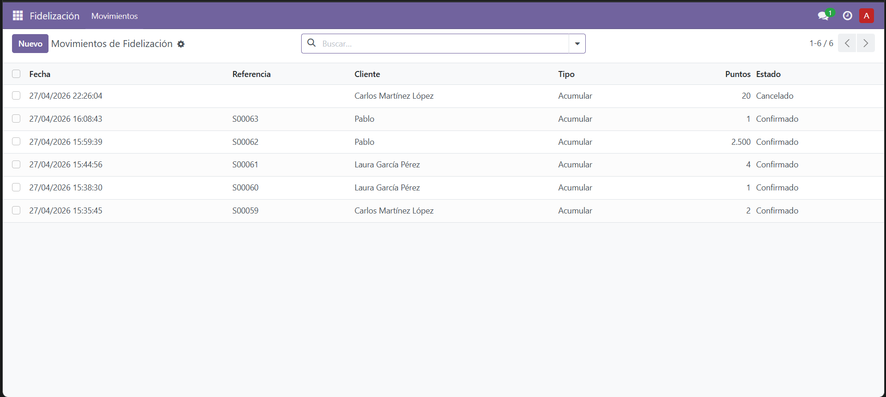
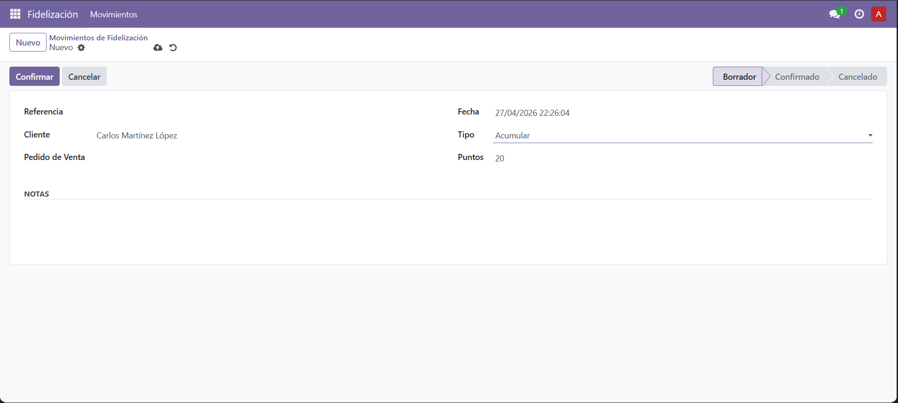
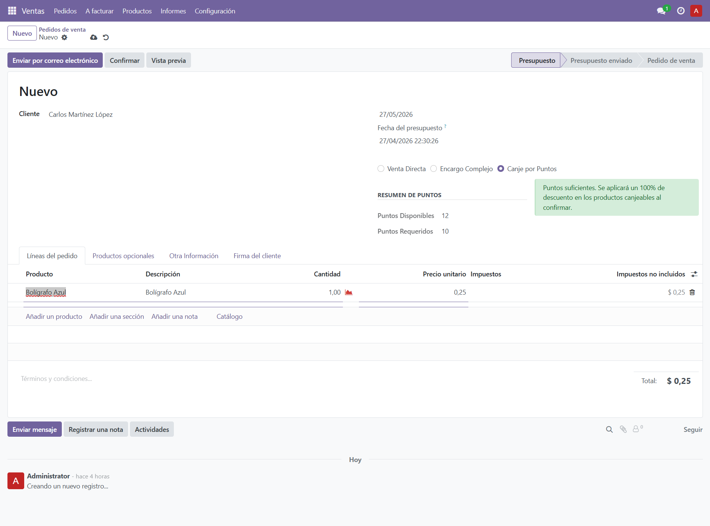
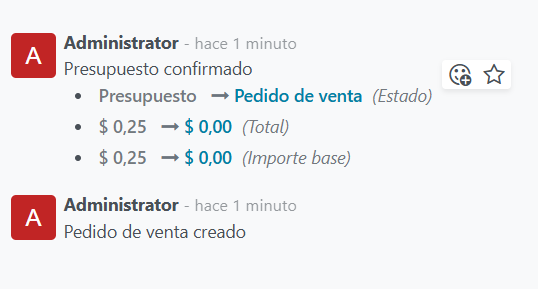

# Documentación Técnica y Funcional — Módulo `pap_loyalty`
**Proyecto:** Papelería El Estudiante — Sistema Integrado de Fidelización  
**Versión Odoo:** 17.0  
**Versión módulo:** 17.0.1.0.0  
**Fecha:** 2026-04-27

---

## 1. Introducción y Resumen del Proyecto

El módulo `pap_loyalty` digitaliza el programa de fidelización de **Papelería El Estudiante**. Extiende el núcleo de ventas de Odoo 17 para acumular puntos por compra, permitir su canje como medio de pago y registrar cualquier ajuste manual sobre el saldo de un cliente.

El proyecto se despliega mediante **Docker Compose** con los siguientes servicios relevantes:

| Servicio | Imagen | Puerto | Rol |
|---|---|---|---|
| `odoo` | `odoo:17.0` | 8069 | Motor de datos y lógica de negocio |
| `db_odoo` | `postgres:15` | — | Base de datos relacional de Odoo |
| `n8n` | `n8nio/n8n:1` | 5678 | Orquestador de integraciones y webhooks |
| `bonita` | `bonita:2023.2` | 8081 | Gestor de procesos BPM y tareas humanas |

Todos los servicios comparten la red interna `default` y exponen sus interfaces hacia el exterior a través de la red `proxy`.

---

## 2. Estructura del Módulo

```
pap_loyalty/
├── __init__.py
├── __manifest__.py                        # Declaración, dependencias y lista de archivos de datos
├── data/
│   └── demo.xml                           # Datos de demostración
├── models/
│   ├── __init__.py
│   ├── pap_loyalty_move.py                # Modelo transaccional de puntos
│   ├── pap_loyalty_point_wizard.py        # Asistente de ajuste manual (TransientModel)
│   ├── product_template.py                # Extensión: flags y coste en puntos del producto
│   ├── res_partner.py                     # Extensión: saldo, consentimiento e historial del cliente
│   └── sale_order.py                      # Extensión: tipo de operación y lógica de canje
├── security/
│   └── ir.model.access.csv                # Permisos CRUD por grupo
└── views/
    ├── pap_loyalty_move_views.xml          # Lista, formulario y menú de movimientos
    ├── pap_loyalty_point_wizard_views.xml  # Formulario modal del asistente
    ├── product_template_views.xml          # Campos de fidelización en la ficha de producto
    ├── res_partner_views.xml               # Pestaña Fidelización en la ficha de cliente
    └── sale_order_views.xml               # Campo tipo operación y bloque de puntos en el pedido
```

---

## 3. Arquitectura de Integración

El flujo de alto nivel sigue una arquitectura **event-driven** basada en tres capas:

```
[Odoo 17]  ──webhook/API──►  [n8n]  ──HTTP POST──►  [Bonita BPM]
   │                           │
   │ (JSON-RPC)                └──► Crea pap.loyalty.move vía API
   │
   └── Lógica transaccional nativa (canje, validación de saldo)
```

- **Odoo** es el sistema de registro (*system of record*): valida, persiste y calcula.  
- **n8n** reacciona a eventos de Odoo (ventas confirmadas) y orquesta acciones externas asíncronas.  
- **Bonita BPM** gestiona el flujo de trabajo humano para encargos complejos (asignación, preparación, entrega).


---

## 3. Modelos de Datos (Diccionario de Datos)

### `res.partner` — Extensión del cliente

Añade el saldo de puntos calculado en tiempo real a partir del historial de movimientos, el consentimiento comercial y un acceso directo al asistente de ajuste.

```python
loyalty_points = fields.Integer(
    compute='_compute_loyalty_points', store=True
)
# Suma únicamente movimientos en estado 'done'
partner.loyalty_points = sum(
    move.points for move in partner.loyalty_move_ids
    if move.state == 'done'
)
```

---

### `product.template` — Extensión del producto

Define dos flags independientes: si el producto genera puntos al venderse (`loyalty_eligible`) y si puede adquirirse canjeando puntos (`redeemable`), junto con su coste en puntos.

```python
loyalty_eligible = fields.Boolean(string='Apto para Fidelización')
redeemable       = fields.Boolean(string='Canjeable con Puntos')
loyalty_ratio    = fields.Float(string='Ratio pts/€')
loyalty_cost     = fields.Integer(string='Coste en Puntos')
```

---

### `sale.order` — Extensión del pedido de venta

Clasifica cada venta en tres modalidades y, en modo canje, valida el saldo antes de confirmar y aplica un descuento del 100 % sobre las líneas canjeables.

```python
x_tipo_operacion = fields.Selection([
    ('venta_directa', 'Venta Directa'),
    ('encargo',       'Encargo Complejo'),
    ('canje_puntos',  'Canje por Puntos'),
])

# En action_confirm(), si x_tipo_operacion == 'canje_puntos':
if not order.x_puntos_suficientes:
    raise UserError("Puntos insuficientes.")
for line in order.order_line:
    if line.product_id.redeemable:
        line.discount = 100.0
```

Campos computados de apoyo: `x_puntos_disponibles` (related), `x_puntos_requeridos` (suma de `loyalty_cost × qty`), `x_puntos_suficientes` (booleano).

---

### `pap.loyalty.move` — Movimiento de puntos

Tabla transaccional que registra cada variación de saldo. Los puntos negativos representan canjes o ajustes a la baja; los positivos, acumulaciones.

```python
move_type = fields.Selection([
    ('earn',   'Acumular'),
    ('redeem', 'Canjear'),
    ('adjust', 'Ajuste'),
])
state = fields.Selection([
    ('draft', 'Borrador'), ('done', 'Confirmado'), ('cancelled', 'Cancelado')
])
# Solo los movimientos 'done' afectan al saldo del cliente.
```

---

### `pap.loyalty.point.wizard` — Asistente de ajuste manual

`TransientModel` que permite crear un movimiento de tipo `adjust` directamente desde la ficha del cliente, sin necesidad de navegar al menú de movimientos.

```python
class PapLoyaltyPointWizard(models.TransientModel):
    _name = 'pap.loyalty.point.wizard'

    partner_id = fields.Many2one('res.partner', required=True, readonly=True)
    points     = fields.Integer(required=True)   # positivo o negativo
    notes      = fields.Text()

    def action_apply(self):
        self.env['pap.loyalty.move'].create({
            'move_type': 'adjust', 'state': 'done', ...
        })
```

---

## 4. Interfaz de Usuario (Vistas)

### Vistas modificadas (herencia)

| Vista base | Modificación |
|---|---|
| `sale.order` (formulario) | Campo radio `x_tipo_operacion` tras *Plazos de pago*; bloque condicional con puntos disponibles/requeridos y alertas de suficiencia. |
| `res.partner` (formulario) | Nueva pestaña **Fidelización** con saldo, botón *Añadir / Ajustar Puntos* e historial de movimientos en modo lectura. |
| `product.template` (formulario) | Campos `loyalty_eligible`, `redeemable`, `loyalty_ratio` y `loyalty_cost` en pestaña de configuración. |

### Vistas nuevas

| Modelo | Vistas | Descripción |
|---|---|---|
| `pap.loyalty.move` | `tree`, `form` | Lista y detalle de movimientos con botones **Confirmar** / **Cancelar** en la cabecera. |
| `pap.loyalty.point.wizard` | `form` (modal) | Formulario emergente con cliente (solo lectura), puntos y notas. |

### Menú creado

```
Fidelización
└── Movimientos   →  pap.loyalty.move (tree/form)
```





---

## 5. Flujos de Trabajo (Workflows)

### Flujo 1 — Venta Directa (`venta_directa`)

```
Usuario confirma pedido (x_tipo_operacion = 'venta_directa')
    │
    ├─► Odoo confirma la venta (estado → sale)
    │
    └─► Webhook disparado hacia n8n
            │
            └─► n8n llama a Odoo JSON-RPC
                    └─► Crea pap.loyalty.move (move_type='earn', state='done')
                            └─► loyalty_points del cliente se actualiza
```

**Resultado:** El cliente acumula puntos proporcionales a los productos elegibles del pedido.

---

### Flujo 2 — Canje por Puntos (`canje_puntos`)

```
Usuario selecciona "Canje por Puntos" en el pedido
    │
    ├─► Vista muestra x_puntos_disponibles y x_puntos_requeridos en tiempo real
    │
    └─► Usuario confirma
            │
            ├─► [GUARD] x_puntos_suficientes == False → UserError, bloqueo
            │
            └─► [OK] action_confirm():
                    ├─► discount = 100% en líneas redeemable
                    ├─► Venta confirmada (total neto = 0 €)
                    └─► Crea pap.loyalty.move (move_type='redeem', points=-N, state='done')
                                └─► Saldo del cliente decrementado
```

**Resultado:** El cliente paga con puntos; el pedido queda en cero monetariamente y el saldo se descuenta de forma atómica con la confirmación.




---

### Flujo 3 — Encargo Complejo (`encargo`)

```
Usuario confirma pedido (x_tipo_operacion = 'encargo')
    │
    ├─► Odoo confirma la venta
    │
    └─► Webhook disparado hacia n8n
            │
            └─► n8n autentica contra Bonita BPM (usuario/contraseña)
                    │
                    └─► n8n realiza POST a la API REST de Bonita
                            └─► Se instancia nuevo caso en el proceso de preparación
                                    └─► Tarea humana asignada al equipo de tienda en Bonita
```

**Resultado:** Se abre automáticamente una tarea de preparación en Bonita BPM sin intervención manual del operador.


---

*Documento generado a partir del código fuente. Actualizar en cada sprint que modifique modelos o flujos.*
